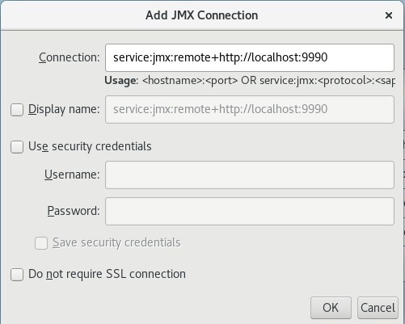

Configure VisualVM to monitor JBoss EAP instances
=================================================

Launch VisualVM adding jboss-cli-client.jar to the classpath.

::

    export JBOSS_HOME=</path/to/jboss/installation>
    visualvm --cp:a ${JBOSS_HOME}/bin/client/jboss-cli-client.jar -J-Dmodule.pah=${JBOSS_HOME}/modules

When done, create new **Local** or **Rmote** Jmx connectoin using the remote+http protocol:

Local connections
-----------------

To create a new Local connection right click on **Local** and select *Add JMX Connection*. The following
dialog box will appear:

Click **OK** and the connection will be listed under the **Local** tree.

